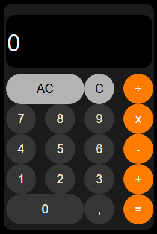

# Projeto proposto no curso Técnico em desenvolvimento de sistemas.
## Calculadora

### Nesse projeto foi utilizado as seguintes técnologias e ferramentas:

<div style="margin-left: 10px; display: flex; gap: 50px;"> 
<div style="display: flex; gap: 25px;"> 
  
 
   
  </div> <br>
<div style="display: flex; gap: 25px;"> 

  
  
  </div>
</div>

---

## Desafio:

Para mim foi um desafio criar essa calculadora desde o início, pois algumas coisas já era conhecidas, porém outras tive que buscar e realizar pesquisas. Consegui ter um resultado satisfatório e acredito que para o proposto consegui superar as expectativas.

# A calculadora



 - **Minha ideia era deixar ela semelhante a que possuimos nos celulares, em específico do Iphone.**
---

# Como utilizá-la?

- Primeiro faça um clone do repositório no seu PC:

```
git clone https://github.com/marcelodecarli/calculadora.git
```
### Abrindo a calculadora no navegador
Após clonar o repositório, abra a pasta clonada e clique duas vezes no arquivo `index.html` para abrir a calculadora no seu navegador. Agora, você pode usá-la clicando nos botões com o mouse. <mark>Não utilizar o teclado numérico</mark>


## Criação
 Para construção dessa calculadora foi utilizado Display Grid. Ao qual criei na `main` cada uma das linhas para deixar no padrão desejado por mim. No meu entendimento ficou mais claro e mais simples separar dessa maneira. Sendo posteriormente subdivido cada uma das linhas como o Display Grid também. Cada um com sua particularidade. Segue como ficou o código e suas partes:

* Para estilização e organização coloquei tudo no arquivo CSS `index.css` <br><br>
 
 
 `main`
 ```
main {
    background-color: rgb(27, 27, 27);
    border-radius: 15px;   
    width: 255px;
    height: 380px;
    display: grid;
    grid-template-columns: 1fr;
    grid-template-rows: 100px 1fr 1fr 1fr 1fr 1fr;
    grid-template-areas:
        "input"
        "linha1 "
        "linha2 "
        "linha3 "
        "linha4 "
        "linha5 "
    ;  
}
 ```

 ### As linhas criadas no `main` vistas separadamente:
- Após como visto separei por linhas: <br><br>

`input` 

- `HTML` 
```
<input id="display" type="text"></input>
```
- `CSS`
```
input{
    grid-area: form;
    margin-bottom: 10px;
}
```

No `input` tenho o display da calculadora, sendo ele quem recebe os valores digitados na calculadora:
<br><br>

---
`linha1`

```
            <div id="linha1">
                <button class="duplo" id="ac">AC</button>
                <button class="botao" id="c">C</button>
                <button class="botao operacao" id="operDiv">÷</button>
            </div>
```
- `CSS`

```
#linha1 {
    grid-area: linha1;
    display: grid;   
    grid-template-columns: 2fr 1fr 1fr;
    grid-template-areas:
        "ac c operDiv";
}
```

- Cada uma das linhas foi colocado o Display Grid também podendo ter a organização conforme a minha necessidade.

### Configuração de estilização do display:


```
#display {
    grid-area: display;
    background-color: black;
    color: aliceblue;
    border: none;
    width: 239px;
    height: 85px;
    border-radius: 15px;
    font-size: 40px;
    font-family: system-ui, -apple-system, BlinkMacSystemFont, 'Segoe UI', Roboto, Oxygen, Ubuntu, Cantarell, 'Open Sans', 'Helvetica Neue', sans-serif;
}
```

### Estilização dos botões geral:

```
.botao {
    
    background-color: #b3b3b3;
    width: 50px;
    height: 50px;
    border-radius: 50%;
    border: none;
    font-size: 20px;
}

/*Quando passar o mouse em cima ou quando for clicar muda a aparência*/
.botao:hover {
    background-color: lightgray;
    cursor: pointer;
    border: solid white 2px;
    width: 50px;
    height: 50px;
    border-radius: 50%;
}
```

### Estilização dos botões estendidos (duplo):

```
.duplo {
    
    background-color: #b3b3b3;
    border: none;
    border-radius: 30px;
    font-size: 20px;
}

/*Quando passar o mouse em cima ou quando for clicar muda a aparência*/
.duplo:hover {
    background-color: lightgrey;
    cursor: pointer;
    border: solid white 2px;
    border-radius: 30px;
}
```
### Estilização específica dos botões de operações(`+` `-` `x` `÷` `=`):

```
.operacao {
    background-color: rgb(255, 123, 0);
    color: white;
    font-size: 20px;
}

.operacao:hover {
    background-color: rgb(248, 151, 59);
    cursor: pointer;
}
```
### Estilização específica dos números e da vírgula(`0` `1` `2` `3` `4` `5` `6` `7` `8` `9` `,`):

```
.cinza{
    background-color: rgb(54, 54, 54);
    color: antiquewhite;
}
.cinza:hover{
    background-color: rgb(87, 86, 86);
    color: antiquewhite;
}
```
### Estilização específica das áreas da grid
```
#ac{grid-area: ac;}
#c{grid-area: c }
#operDiv{grid-area: operDiv}
#sete{grid-area: sete}
#oito{grid-area: oito }
#nove{grid-area: nove }
#operMulti{grid-area: operMulti }
#quatro{grid-area: quatro}
#cinco{grid-area: cinco}
#seis{grid-area: seis}
#operMenos{grid-area: operMenos }
#um{grid-area: um }
#dois{grid-area: dois }
#tres{grid-area: tres}
#operSomar{grid-area: operSomar }
#zero{grid-area: zero }
#virgurla{grid-area: virgula}
#igual{grid-area: igual}
```
- Cada ID representa uma área da grid, possibilitando a disposição dos elementos em locais definidos dentro de um contêiner de grid, otimizando a organização e o design da interface.

# Funções no arquivo `index.js`

Nesse arquivo é que toda "magia" acontece. As funções da calculadora estão todas nesse arquivo. Verifique sobre o código acessando o [Arquivo Javascript](https://github.com/marcelodecarli/calculadora/blob/main/js/index.js)

# Resumo dos métodos criados para esse projeto:

- **Estado Inicial da <mark>Calculadora</mark>:** O objeto <mark>initialState</mark> define o estado inicial da calculadora, incluindo o valor exibido, se deve limpar o display, a operação atual, os valores e o índice do valor atual.

- **Classe Calculadora:** A classe <mark>Calculadora</mark> inicializa seu estado com uma cópia do initialState, garantindo que o objeto original permaneça intacto. O método init é chamado no construtor para configurar a calculadora imediatamente após sua criação.

- **Método init:** Esse método configura o display com o valor inicial e associa os botões aos eventos de clique, que chamam métodos específicos para limpar a memória (como <mark>clearMemory</mark>) ou definir operações (como <mark>setOperation</mark>). Cada botão numérico também é vinculado ao método addDigit, permitindo a adição de números ao display.

- **Método <mark>clearMemory</mark>:** Reinicia o estado da calculadora para os valores definidos em <mark>initialState</mark>, limpando todos os dados e cálculos.

- **Método <mark>setOperation</mark>:** Define a operação matemática. Se current for 0, atualiza o estado com a nova operação e muda current para 1. Se já houver uma operação, executa a lógica de cálculo, utilizando eval para calcular o resultado e arredondá-lo, tratando inconsistências do JavaScript.

- **Método <mark>addDigit</mark>:** Permite que o usuário adicione dígitos ao display, verificando se o ponto decimal pode ser adicionado e atualizando o valor exibido e os valores da operação. Limita o display a um máximo de 11 caracteres.

- **Método <mark>setState</mark>:** Atualiza o estado da calculadora e redefine o valor do display para refletir o novo estado. Cada clique apresenta o valor atual e, ao clicar em `=`, mostra o resultado do cálculo, permitindo que o último valor seja utilizado.

- **Instanciação da <mark>Calculadora</mark>:** A calculadora é iniciada instanciando a classe <mark>Calculadora</mark>, ativando suas funções.

